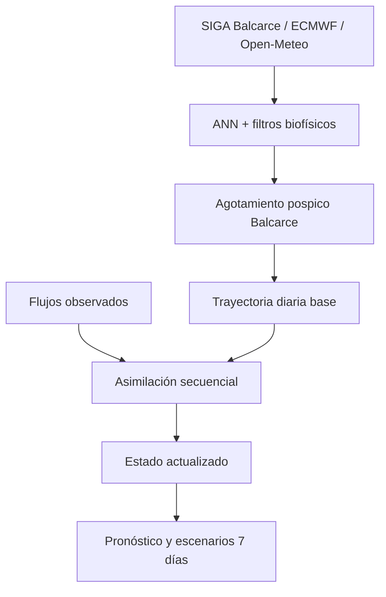

# PREDWEEM Digital Twin — Lolium Balcarce

Gemelo digital agronómico para la dinámica de emergencia de *Lolium
multiflorum* en Balcarce, provincia de Buenos Aires.

El proyecto deriva del motor científico
[`PREDWEEM/LOLIUM_BAL2026`](https://github.com/PREDWEEM/LOLIUM_BAL2026),
que se mantiene intacto. Este repositorio agrega una capa independiente de
estado, asimilación de observaciones, persistencia por lote, pronóstico a siete
días y simulación de escenarios.

## Arquitectura



## Perfil concentrado de Balcarce

La ANN utiliza las cuatro entradas originales: día juliano, TMAX, TMIN y
precipitación. Después de los filtros térmico e hídrico se aplica el perfil
local:

- coordenadas de referencia: `-37.7664, -58.2999`;
- latencia inicial hasta JD 25;
- primer pico válido cuando `EMERREL > 0,20`;
- termoinhibición con media móvil de cinco días y umbral de 24 °C;
- choque hídrico de tres días, 45 mm, hasta JD 110;
- decaimiento Weibull pospico con `tau=3,5656 días`, `beta=0,48684` e
  intensidad `0,95`;
- extinción de la cohorte desde 110 días pospico cuando el remanente Weibull es
  menor o igual a `0,005`;
- ventana fenológica sombreada entre 600 y 800 °Cd.

El agotamiento se aplica antes del acumulado y antes de la asimilación. Así, las
observaciones actualizan el estado y el potencial del lote sin volver a
ensanchar la cola del perfil Balcarce.

## Referencia estacional local

El clasificador histórico común contiene campañas de varias localidades. Para
normalizar una campaña meteorológica parcial, este gemelo selecciona únicamente
las curvas cuyo nombre identifica a Balcarce.

La versión inicial dispone de una campaña local dentro del archivo histórico.
Por eso su mediana permite evitar que el último día del pronóstico se interprete
como 100 %, pero P10 y P90 todavía son preliminares. Deben incorporarse nuevas
campañas independientes para estimar incertidumbre histórica local.

## Asimilación de observaciones

Los conteos en plantas/m² se interpretan como flujo ocurrido entre dos fechas
de muestreo:

\[
Y_i = N \sum_{d=t_{i-1}+1}^{t_i} e_d
\]

donde `Y_i` es el flujo observado, `e_d` el flujo diario de PREDWEEM y `N`
el potencial estacional latente. El gemelo estima `N` sin tratar una serie
parcial como si estuviera completa.

La corrección usa una ganancia escalar:

\[
K = \frac{P}{P+R}, \qquad x^+ = x^- + K(y-x^-)
\]

Después de cada observación, la trayectoria futura se reancla sobre la fracción
remanente del perfil concentrado. La asimilación no recalibra automáticamente
los pesos de la ANN ni los parámetros Weibull.

## Datos admitidos

La pestaña **Observaciones** acepta CSV, TSV, XLS o XLSX con:

| Estructura | Interpretación |
|---|---|
| `FECHA + PLM2` | Flujo de plantas/m² por intervalo |
| `FECHA + EMERGENCIA_ACUMULADA` | Acumulado 0–1 o 0–100 % |
| `Fecha + 1 + 2 + 3 + media(SR).m2` | Tres repeticiones y media por m² |
| `FECHA + COBERTURA_PCT` | Cobertura variable del rastrojo |

Emergencia y cobertura pueden estar en el mismo archivo. Las observaciones y
mediciones guardadas pueden borrarse desde la interfaz.

Cuando existen tres repeticiones, la incertidumbre se estima desde su error
estándar, con un mínimo de 5 % para representar variación no capturada por los
cuadrantes.

## Meteorología operativa

La fuente primaria es SIGA–INTA Balcarce, estación `A872824`. Los huecos
vencidos se completan provisionalmente con ECMWF IFS histórico y son
reemplazados cuando SIGA publica el dato. Desde la fecha actual se utilizan
siete días de ECMWF IFS ENS 0,25° y el percentil 50 de temperatura y
precipitación.

También se admite Open-Meteo georreferenciado o un archivo meteorológico
cargado por el usuario.

## Funciones

- estado persistente e independiente por lote;
- meteorología observada hasta la fecha del estado y pronóstico a siete días;
- flujo diario mostrado con barras azules;
- curva PREDWEEM base frente al estado actualizado;
- potencial estacional automático u opcionalmente informado;
- cobertura constante o serie observada interpolada;
- escenarios de lluvia y temperatura;
- hitos d25, d50, d75 y d95;
- ventana fenológica 600–800 °Cd;
- auditoría de innovaciones, incertidumbres y ganancias;
- exportación CSV de la trayectoria completa.

## Ejecución local

```bash
python -m venv .venv
source .venv/bin/activate
python -m pip install -r requirements.txt
streamlit run app.py
```

En Windows PowerShell:

```powershell
.venv\Scripts\Activate.ps1
streamlit run app.py
```

## Pruebas

```bash
python -m pytest -q
```

Las pruebas cubren los límites biofísicos, el decaimiento y la extinción de la
cohorte, la referencia local, la asimilación, la cobertura variable, la
persistencia y los escenarios.

## Alcance

Esta es una versión MVP experimental. La referencia estacional local y la capa
de asimilación deben validarse prospectivamente con campañas independientes
antes de establecer precisión operativa. PREDWEEM es soporte para decisión y no
reemplaza el monitoreo del lote ni el criterio profesional responsable.

## Autoría

**PREDWEEM by Guillermo R. Chantre**

Consulte [COPYRIGHT.md](COPYRIGHT.md) y
[MODEL_PROVENANCE.md](MODEL_PROVENANCE.md).

## Cierre meteorológico de la campaña 2026

La serie operativa termina el **1 de octubre de 2026, inclusive**. El límite
se aplica a SIGA, al puente provisional, al pronóstico ECMWF, a la consulta
Open-Meteo y a los archivos cargados en la aplicación. Después del cierre,
las actualizaciones pueden completar o reemplazar datos provisionales por
observaciones hasta esa fecha, sin agregar días posteriores ni exigir
pronósticos futuros. La interfaz reduce el horizonte esperado al acercarse
al cierre. Las referencias históricas de emergencia mantienen su extensión.
