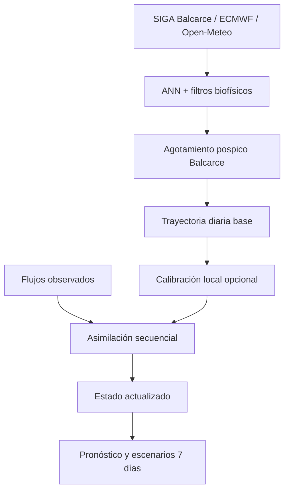

# PREDWEEM Digital Twin — Lolium Balcarce

Gemelo digital agronómico para la dinámica de emergencia de *Lolium
multiflorum* en Balcarce, provincia de Buenos Aires.

El proyecto deriva del motor científico
[`PREDWEEM/LOLIUM_BAL2026`](https://github.com/PREDWEEM/LOLIUM_BAL2026),
que se mantiene intacto. Este repositorio agrega una capa independiente de
estado, asimilación de observaciones, persistencia por lote, pronóstico a siete
días y simulación de escenarios.

## Visitas periódicas para reducir la hibernación

El workflow [mantener_activo.yml](.github/workflows/mantener_activo.yml) abre
[la aplicación de Balcarce](https://jzthpzmfwwtom44dsvkjapp.streamlit.app/)
con Chromium cada cuatro horas: 00:41, 04:41, 08:41, 12:41, 16:41 y 20:41 UTC
(01:41, 05:41, 09:41, 13:41, 17:41 y 21:41 de Argentina).
También permite ejecución manual desde
**Actions → Mantener activo el gemelo Balcarce → Run workflow** y se ejecuta
al modificar el workflow o su script.

Cuando aparece **Yes, get this app back up!**, la tarea hace clic en el botón
y espera la apertura, con un límite total de cinco minutos. Comprueba el
encabezado de Balcarce, el indicador de emergencia, el panel principal y su
gráfico, incluso si están dentro de un iframe. Una respuesta HTTP 200 por sí
sola no cuenta como éxito. Si la app muestra una excepción o no termina de
cargar, la ejecución queda fallida; los avisos dependen de las preferencias
de notificaciones de GitHub Actions.

La tarea no requiere secretos ni modifica observaciones o parámetros del modelo.
Playwright se instala solamente en el ejecutor de Actions. Esto reduce el riesgo
de hibernación, pero **no garantiza disponibilidad continua**:
[Streamlit suspende las apps sin visitas durante 12 horas](https://docs.streamlit.io/deploy/streamlit-community-cloud/manage-your-app#app-hibernation)
y [GitHub puede demorar tareas o desactivarlas tras 60 días sin actividad en un repositorio público](https://docs.github.com/en/actions/reference/workflows-and-actions/events-that-trigger-workflows#schedule).
Si ocurre lo último, vuelva a habilitar el workflow desde Actions.

## Arquitectura


```mermaid
flowchart TD
    A["SIGA Balcarce / ECMWF / Open-Meteo"] --> B["ANN + filtros biofísicos"]
    B --> C["Agotamiento pospico Balcarce"]
    C --> D["Trayectoria diaria base"]
    E["Flujos observados"] --> F["Asimilación secuencial"]
    D --> I["Calibración local opcional"]
    I --> F
    F --> G["Estado actualizado"]
    G --> H["Pronóstico y escenarios 7 días"]
```

## Perfil concentrado de Balcarce

La ANN utiliza las cuatro entradas originales: día juliano, TMAX, TMIN y
precipitación. Después de los filtros térmico e hídrico se aplica el perfil
local:

- coordenadas de referencia: `-37.7664, -58.2999`;
- latencia inicial hasta JD 25;
- primer pico válido cuando `EMERREL > 0,20`;
- termoinhibición con media móvil de cinco días y umbral de 24 °C;
- choque hídrico de tres días, 45 mm, hasta JD 110;
- decaimiento Weibull pospico con `tau=3,5656 días`, `beta=0,48684` e
  intensidad `0,95`;
- extinción de la cohorte desde 110 días pospico cuando el remanente Weibull es
  menor o igual a `0,005`;
- ventana fenológica sombreada entre 600 y 800 °Cd.

El agotamiento se aplica antes del acumulado y antes de la asimilación. Así, las
observaciones actualizan el estado y el potencial del lote sin volver a
ensanchar la cola del perfil Balcarce.

## Referencia estacional local

El pool admite **exclusivamente Balcarce 2014, Balcarce 2025 y Balcarce 2026**,
con el mismo peso por campaña, independientemente de la unidad o cantidad de
plantas registrada:

- **2014:** serie semanal de *Lolium multiflorum* en Balcarce digitalizada de
  la Figura 2 de Diez de Ulzurrun, Vigna, Leaden y Martino (2015, ALAM/ASACIM).
  Está en `data/reference/balcarce_2014_weekly.csv` (31 muestreos, 10/03 al
  06/10/2014, **porcentaje semanal del total anual**, no plantas/m²).
  La procedencia, el hash del PDF y del CSV, el método de digitalización y la
  verificación de especie están en `balcarce_2014_source.json`.
- **2025:** curva `emererel2025 balcarce.xlsx`, identificada dentro de
  `models/modelo_clusters_k3.pkl` y normalizada por su propio total.
- **2026:** `data/calibration/balcarce_2026_counts.csv`, 18 fechas del
  **12/03 al 15/08/2026**, con **8280 plantas/m²** registradas. El acumulado
  se divide por el total de esa ventana y se interpola entre visitas.

Quedan excluidas 2008, 2009, 2010, 2011, 2012, 2013, 2015, 2023, 2024, San
Pedro y Tres Arroyos 2025, y la curva sin etiquetar `2014.xlsx` del archivo
compartido (no es la serie publicada). Una lista positiva impide incorporar
otras series por cambios en los filtros o en el archivo compartido. No se
modifican las curvas originales del modelo.

**Limitaciones de Balcarce 2014**

- Es una digitalización de un gráfico vectorial (centros de marcador y
  calibración de ejes); la precisión es del orden de décimas de punto
  porcentual (valores menores a 0,3 equivalen a cero). No es la tabla original. La suma es 100,22 %, que se normaliza.
- **No tiene cero inicial:** la primera semana (10/03) ya concentra 18,1 % y
  la siguiente 35,3 %. No se infiere ausencia previa de emergencia; el progreso
  anterior al 10/03 queda sin dato en esa curva.
- Se verificó que es *Lolium* y no *Avena fatua* (leyenda, página y porcentajes
  del texto): 83,5 % entre marzo y abril (el trabajo indica más del 80 %) y 1,8 % en
  agosto–septiembre. El
  cargador rechaza una serie que no cumpla esa forma, o cuyo hash no coincida.
- La meteorología SIGA A872824 de 2014 se guarda como respaldo
  (`balcarce_2014_weather.csv`) pero **el modelo no la usa**. Tiene un hueco del
  16 al 20/03/2014, justo en la semana de mayor emergencia.

La referencia 2014 se habilita desde el **10/09/2015** (presentación del
trabajo); para cortes anteriores no se usa. La referencia 2026 se habilita
desde el **15/08/2026**, cuando se conoce su total registrado. Para cortes
anteriores a esas fechas se usa solo lo disponible, incluso al ajustar y
evaluar intervalos de la calibración: hasta el 09/09/2015 solo 2025, entre 10/09/2015 y 14/08/2026 se usan
2014 y 2025 y desde 15/08/2026 las tres campañas. La inclusión en el pool no
inserta esos conteos como observaciones del lote.

**Efecto sobre el porcentaje mostrado.** En Balcarce la mediana del pool fija
el denominador de la normalización parcial (total estacional estimado =
emergencia acumulada / progreso mediano a la fecha de corte). Por eso sumar
2014 **no es solo descriptivo**: baja el progreso mediano de referencia y sube
el total estacional estimado en cortes de otoño. Con la meteorología 2026 el
progreso mediano a fecha pasa, por ejemplo, de 82 % a 69 % el 31/03 y de 91 % a
85 % el 15/04 y de 99,3 % a 97,8 % el 31/05; la diferencia
se reduce hacia el final de la temporada. Los parámetros de calibración
(offset 0,65; pendiente 1,425) no cambian, pero los retrospectivos por corte sí.

Antes del 10 de marzo no hay referencia 2014 y antes del 12 de marzo no hay
referencia 2026. Al sumarse una curva, los cuantiles pueden disminuir por el
cambio de composición; se conserva el máximo acumulado previo para evitar
retrocesos artificiales (P10 queda plano unos días a mediados de marzo).
Los cuantiles empíricos, las curvas, el número de campañas por día y las
exclusiones se pueden consultar y descargar en **Trazabilidad**. P10 y P90
son descriptivos de estos pocos años, no intervalos de confianza.

Después del último conteo de 2026 se conserva su 100 % como supuesto de
referencia; la curva individual auditable se limita a la ventana registrada.
El final del archivo no certifica el fin biológico de la emergencia y el
100 % no representa agotamiento del banco de semillas. El flujo histórico
se deriva del acumulado interpolado; no son observaciones diarias.

## Alerta preventiva de inicio y fecha de monitoreo

Activada por defecto en **Configuración del gemelo**, con opción de desactivarla.
Consulta la trayectoria base de Balcarce desde el comienzo de la campaña y avisa
cuando `Primer_Pico_Habilitado` se activa entre mañana y el séptimo día, inclusive.
Muestra la fecha modelada y los días de anticipación disponibles para organizar
una recorrida. Funciona sin conteos de campo. Si hay un conteo positivo del lote
hasta el corte, informa que ya había emergencia a más tardar en esa visita;
no lo convierte en el día exacto de inicio.

El gráfico de flujo muestra una **flecha vertical violeta** sobre el día calendario
de la alerta inicial de monitoreo: **inicio modelado menos siete días**, con etiqueta
`DD/MM/AAAA · estimada`. Se conserva en las vistas semanal y diaria, sin moverla al
lunes ni al centro de la columna. Se recalcula con la información disponible al
corte; no acredita que se haya emitido un aviso en esa fecha. Sin inicio modelado
en el horizonte, con la alerta desactivada o fuera del calendario visible, no se dibuja.

La alerta **no desplaza curvas ni el origen del tiempo térmico** y conserva los
umbrales, el decaimiento Weibull y la extinción de la cohorte de Balcarce.
Es un aviso visual en la app, no una notificación externa. Puede anticipar hasta
siete días; no garantiza detectar cada inicio. Si faltan días, indica horizonte
incompleto y no descarta emergencia; una señal positiva dentro de los días
disponibles sí activa vigilancia preventiva. Las revisiones con meteorología
histórica o emisiones posteriores al corte se identifican explícitamente y no
equivalen a pronósticos emitidos anticipadamente.
El detalle queda en Trazabilidad y en el estado guardado (`onset_alert`), incluida
la fecha estimada (`monitoring_alert_date`).

## Gráficos y configuración

La configuración está en el cuerpo principal, sin menú lateral. Dos gráficos
paralelos muestran **flujo de emergencia** y **emergencia acumulada**, con eje
temporal del 1 de enero al **1 de octubre**. El pool histórico se muestra con
colores tenues durante toda la ventana disponible; el gemelo muestra la
meteorología disponible y hasta siete días de proyección desde el corte.
No se muestran curvas anuales históricas separadas en el gráfico principal.

El flujo inicia en vista **Semanal**, con alternativa **Diario**. Ambas series
usan porcentaje del total por semana o día: histórico respecto de su ventana
registrada y gemelo respecto del total estacional estimado. Las semanas se
suman de lunes a domingo; las barras parciales se muestran grises y rayadas e indican cuántos
días incluyen. La interpolación entre visitas suaviza los picos históricos.
El cambio de frecuencia no altera el acumulado ni el estado del gemelo.

Las columnas completas se colorean con la misma clasificación del indicador:
**rojo** (>75 % del máximo semanal histórico), **naranja** (25–75 % inclusive),
**amarillo** (>0 y <25 %) y **verde** (flujo cero). El denominador proviene del
pool local de Balcarce 2025–2026 disponible para la fecha consultada: antes del
15/08/2026 se usa únicamente 2025. Esta comparación solo determina el color;
la altura sigue siendo el porcentaje del total estacional. El histórico usa los
mismos colores con menor opacidad. Las semanas completas sin flujo del gemelo se
señalan con marcas verdes en y=0. Una semana parcial, inválida o un flujo positivo
sin máximo histórico disponible queda sin categoría, en gris. El cursor muestra
la categoría y el porcentaje del máximo. Las barras abarcan lunes–domingo;
el indicador a siete días utiliza mañana–día 7, que puede cruzar dos semanas.

## Intensidad de emergencia a siete días

Se suma `EMERREL_TWIN` desde el día siguiente al corte hasta siete días después,
y se divide por el máximo semanal del pool histórico orientativo del mismo
gráfico. El máximo usa exclusivamente semanas completas de lunes a domingo
entre enero y el 1 de octubre, con la referencia disponible en ese corte.

- 🔴 **Alta:** más del 75 % del máximo histórico.
- 🟠 **Media:** del 25 al 75 %, ambos límites incluidos.
- 🟡 **Baja:** flujo positivo menor al 25 % del máximo.
- 🟢 **Nula:** flujo semanal exactamente cero, con siete días válidos.

Sin siete días futuros válidos se indica pronóstico ausente o incompleto en
gris; un horizonte truncado no se clasifica como flujo nulo. Sin máximo
histórico positivo, un flujo positivo se indica sin referencia. La intensidad
es una comparación de flujos, no una probabilidad de emergencia.

## Semáforo térmico desde el primer pico

- 🔴 **FUERA DE CONTROL:** >800 °Cd.
- 🟠 **ULTIMO PLAZO:** >700 y ≤800 °Cd.
- 🟡 **CONTROL A TIEMPO:** ≥600 y ≤700 °Cd.
- 🟢 **AUN NO CONTROLAR:** <600 °Cd.

Se usa el tiempo térmico de la fecha consultada, sin redondear. Estos rótulos
no alteran el cálculo térmico, el decaimiento Weibull ni la extinción de la
cohorte del motor de Balcarce; acompañan el monitoreo y el criterio profesional.

## Asimilación de observaciones

Los conteos en plantas/m² se interpretan como flujo ocurrido entre dos fechas
de muestreo:

\[
Y_i = N \sum_{d=t_{i-1}+1}^{t_i} e_d
\]

donde `Y_i` es el flujo observado, `e_d` el flujo diario de PREDWEEM y `N`
el potencial estacional latente. El gemelo estima `N` sin tratar una serie
parcial como si estuviera completa.

La corrección usa una ganancia escalar:

\[
K = \frac{P}{P+R}, \qquad x^+ = x^- + K(y-x^-)
\]

Después de cada observación, la trayectoria futura se reancla sobre la fracción
remanente del perfil concentrado. La asimilación no recalibra automáticamente
los pesos de la ANN ni los parámetros Weibull.

## Calibración por sitio con datos de 2026

Se incorporó la misma capa externa de Bordenave, **ajustada con los datos y
el motor de Balcarce**. La pestaña **Calibración por sitio** conserva los
conteos, muestra el ajuste y la evaluación temporal, y permite descargar los
datos originales en CSV. Los coeficientes de Bordenave no se transfirieron.

El archivo `VALIDA (1) (4).xlsx`, hoja `Hoja1`, contiene **18 fechas** entre
el 12/03 y el 15/08/2026, en formato `FECHA + PLM2`, sin repeticiones. El
registro inicial de cero delimita el primer intervalo de ocho días hasta el
20/03, con 6300 plantas/m². Se ajustan los **17 intervalos reales**, de 5 a
16 días, sin crear observaciones diarias interpoladas. El total registrado
es **8280 plantas/m²**; no se declara que la campaña haya finalizado ni se
transfiere ese total como potencial de otros lotes.

La serie meteorológica fija abarca **227 días, del 01/01 al 15/08/2026**:
221 observados SIGA Balcarce y 6 provisionales ECMWF histórico. Contiene
TMAX, TMIN, precipitación y procedencia. La meteorología operativa sigue
actualizándose por separado y no modifica automáticamente el perfil.

La transformación es la misma que en Bordenave:

\[
F_{local}=\operatorname{logistic}(a+b\operatorname{logit}(F_{base})).
\]

Se ajustan dos parámetros mediante una búsqueda acotada y regularizada hacia
la identidad (`a ∈ [-1.5, 1.5]`, `b ∈ [0.6, 1.6]`). Cada curva se escala al
total de la ventana muestreada para comparar flujos por intervalo. Esa escala
es auxiliar y no constituye una estimación transferible del potencial.
Al no haber repeticiones, todos los intervalos utilizan el mismo piso de
ponderación: 10 % del máximo flujo observado, **630 plantas/m²**. No se
presenta ese valor como error estándar de muestreo; la columna de error
estándar se deja vacía.

La calibración conserva los pesos de la ANN, los filtros térmicos e hídricos,
el decaimiento Weibull, la extinción de la cohorte y el reloj de 600–800 °Cd.
No crea flujo donde la curva base está detenida. Se usan los valores de la
interfaz local: **cobertura 10 % y Wmax 10 mm**, y el pool histórico local
2025–2026 en el ajuste final. Las evaluaciones anteriores al 15/08 usan sólo
2025 para evitar información futura. El archivo de campo no informa cobertura ni
manejo; cambiar esas condiciones en la interfaz no valida la transferencia
del ajuste a ellas.

### Resultados y uso

El RMSE sobre los 17 intervalos usados para ajustar pasa de **409,21 a
87,68 plantas/m²**. El perfil final tiene `a=0,65`, `b=1,425`, sin alcanzar
los límites permitidos. Es ajuste retrospectivo sobre una sola campaña.

En tres evaluaciones temporales, ajustadas con datos hasta cada corte y
evaluadas en el intervalo siguiente, el RMSE pasa de **3,93 a 5,36 plantas/m²**:
dos intervalos empeoran y uno permanece igual. Los tres son posteriores al
pico principal y sólo evalúan flujos pequeños. Se utiliza meteorología
observada/provisional, no pronósticos archivados. No se ha demostrado una
mejora predictiva ni transferencia entre años.

**Usar calibración local 2026 inicia activado**. El interruptor está sobre los
gráficos de emergencia, en **Estado del lote**, y permite desactivar
y volver a activar la calibración para comparar con PREDWEEM base. La selección
se conserva durante la sesión y actualiza el gráfico, el estado del gemelo,
los escenarios y la exportación auditable. La capa se integra antes de la
asimilación, con estos controles:

- sólo se aplica si se selecciona la localidad Balcarce;
- no utiliza el perfil al consultar fechas anteriores al 15/08/2026;
- si se asimilan conteos de la campaña 2026, conserva la base original para
  evitar reutilizar esa campaña como calibración y nueva evidencia;
- admite asimilar conteos de campañas posteriores sobre el perfil local;
- un cambio del motor, pesos o referencia invalida la huella del perfil;
- conserva separadas las curvas base, calibrada y asimilada.

Los conteos de referencia no se insertan automáticamente en SQLite ni
sobrescriben observaciones guardadas. Para asimilarlos en un lote, descargue
el CSV desde la pestaña y cárguelo en **Observaciones**. El cierre meteorológico
del 01/10/2026 se mantiene; una campaña posterior requiere configurar su
meteorología. El perfil fue recalculado con el pool local el 22/09/2026, por lo que las consultas
retrospectivas de 2026 no se presentan como pronósticos históricos reales.

### Reproducción y trazabilidad

```bash
python scripts/calibrate_site.py
python -m pytest -q
```

Las entradas y salidas se conservan en `data/calibration/`: conteos,
meteorología fija, procedencia, perfil JSON, ajuste por intervalos y evaluación
temporal. Se registran hashes del archivo adjunto, los datos y el modelo.
El identificador del perfil distingue revisiones aun si conservan la última
fecha de muestreo. El script no descarga meteorología ni reentrena la ANN.

El pool y la calibración son capas distintas: desactivar la calibración
conserva la referencia histórica 2025–2026. Los conteos 2026 intervienen tanto
en la referencia final como en su ajuste retrospectivo; ese ajuste no es una
evaluación independiente. La huella del perfil incluye el CSV del pool local.

## Datos admitidos

La pestaña **Observaciones** acepta CSV, TSV, XLS o XLSX con:

| Estructura | Interpretación |
|---|---|
| `FECHA + PLM2` | Flujo de plantas/m² por intervalo |
| `FECHA + EMERGENCIA_ACUMULADA` | Acumulado 0–1 o 0–100 % |
| `Fecha + 1 + 2 + 3 + media(SR).m2` | Tres repeticiones y media por m² |
| `FECHA + COBERTURA_PCT` | Cobertura variable del rastrojo |

Emergencia y cobertura pueden estar en el mismo archivo. Las observaciones y
mediciones guardadas pueden borrarse desde la interfaz.

Cuando existen tres repeticiones, la incertidumbre se estima desde su error
estándar, con un mínimo de 5 % para representar variación no capturada por los
cuadrantes.

## Meteorología operativa

La fuente primaria es SIGA–INTA Balcarce, estación `A872824`. Los huecos
vencidos se completan provisionalmente con ECMWF IFS histórico y son
reemplazados cuando SIGA publica el dato. Desde la fecha actual se utilizan
siete días de ECMWF IFS ENS 0,25° y el percentil 50 de temperatura y
precipitación.

También se admite Open-Meteo georreferenciado o un archivo meteorológico
cargado por el usuario.

## Funciones

- estado persistente e independiente por lote;
- meteorología observada hasta la fecha del estado y pronóstico a siete días;
- flujo diario mostrado con barras azules;
- curva PREDWEEM base frente al estado actualizado;
- potencial estacional automático u opcionalmente informado;
- cobertura constante o serie observada interpolada;
- escenarios de lluvia y temperatura;
- hitos d25, d50, d75 y d95;
- ventana fenológica 600–800 °Cd;
- auditoría de innovaciones, incertidumbres y ganancias;
- exportación CSV de la trayectoria completa.

## Ejecución local

```bash
python -m venv .venv
source .venv/bin/activate
python -m pip install -r requirements.txt
streamlit run app.py
```

En Windows PowerShell:

```powershell
.venv\Scripts\Activate.ps1
streamlit run app.py
```

## Pruebas

```bash
python -m pytest -q
```

Las pruebas cubren los límites biofísicos, el decaimiento y la extinción de la
cohorte, las exclusiones y disponibilidad temporal del pool, los gráficos,
los límites de ambos semáforos, la asimilación, la cobertura variable, la
persistencia y los escenarios.

## Alcance

Esta es una versión MVP experimental. La referencia estacional local y la capa
de asimilación deben validarse prospectivamente con campañas independientes
antes de establecer precisión operativa. PREDWEEM es soporte para decisión y no
reemplaza el monitoreo del lote ni el criterio profesional responsable.

## Autoría

**PREDWEEM by Guillermo R. Chantre**

Consulte [COPYRIGHT.md](COPYRIGHT.md) y
[MODEL_PROVENANCE.md](MODEL_PROVENANCE.md).

## Cierre meteorológico de la campaña 2026

La serie operativa termina el **1 de octubre de 2026, inclusive**. El límite
se aplica a SIGA, al puente provisional, al pronóstico ECMWF, a la consulta
Open-Meteo y a los archivos cargados en la aplicación. Después del cierre,
las actualizaciones pueden completar o reemplazar datos provisionales por
observaciones hasta esa fecha, sin agregar días posteriores ni exigir
pronósticos futuros. La interfaz reduce el horizonte esperado al acercarse
al cierre. Las referencias históricas de emergencia mantienen su extensión.


## Disponibilidad operativa de porcentajes (01/10/2026)

Durante una actualización de Streamlit, la app recarga los módulos locales en
orden de dependencia si cambia el código del paquete. Así evita mezclar una
interfaz nueva con un constructor de estado antiguo sin
`normalization_available`. La misma revisión identifica el modelo en caché;
los cambios normales de fecha no vuelven a cargar los módulos ni borran conteos.

**Normalización inicial:** el ancla usa exclusivamente el último estado hasta
la fecha de corte. Nunca se busca un ancla en los días futuros ni se utiliza el
total del período parcial como sustituto estacional. Se requiere señal
acumulada mayor a 1e-12 y progreso mediano histórico mayor al 1%. Si falta esa
información se muestra **“porcentaje aún no estimable”**: acumulado, remanente,
flujos porcentuales, potencial y densidades modeladas quedan sin estimar.
Esto no equivale a cero ni a intensidad Nula. La alerta inicial y el tiempo
térmico siguen utilizando el motor biofísico original; el histórico permanece
visible como orientación. Al extender el pronóstico no cambia el porcentaje
del pasado para un mismo corte y referencia.

Los conteos pueden cargarse y conservarse en plantas/m² mientras la asimilación
porcentual está pendiente. Cuando existe una normalización válida se vuelven a
utilizar esos conteos originales. La base SQLite admite porcentaje nulo para
estos registros y migra automáticamente las tablas previas conservando sus
filas. Los CSV exportan el indicador `Normalizacion_Disponible` y el motivo.
La llamada al motor **sin fecha de corte** conserva el cálculo retrospectivo
por total del período para diagnósticos; no es la ruta operativa de la app.
